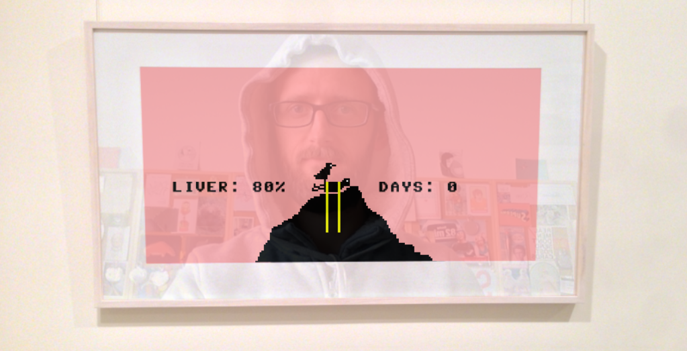

# *Let's Play: Let's Play: Ancient Greek Punishment: Art Edition Edition*

# [Play Online](https://www.pippinbarr.com/lets-play-lets-play-ancient-greek-punishment-art-edition-edition/) (desktop and mobile)

## Description
*It’s a game! In a painting! On a wall! In a gallery! In a game! Or something! Marvel as you once again confront that most boring question! Are games art?! Is art some kind of a damn game to you?!*

*Let's Play: Let's Play: Ancient Greek Punishment: Art Edition Edition* is written in JavaScript with the excellent [Phaser](http://phaser.io/) game framework. It is mobile and touch-screen friendly, but it is best played on a desktop/laptop computer in Chrome, Firefox, or Opera (so that you can use the webcam).

## Press
* [Kill Screen](http://killscreendaily.com/articles/be-complicit-post-modern-monomyth-pippin-barrs-latest/)
* [Rock, Paper, Shotgun](http://www.rockpapershotgun.com/tag/lets-play-lets-play-ancient-greek-punishment-art-edition-edition/)
* [Joystiq](http://www.joystiq.com/tag/Lets-Play-Ancient-Greek-Punishment-Art-Edition-Edition/)

Read the [Press Kit](../press) for press information

## Documentation
* Read the [Process Documentation](../process) process information
* Look at the [Code Repository](https://github.com/pippinbarr/lets-play-lets-play-ancient-greek-punishment-art-edition-edition) for source code etc.

## License
*Let's Play: Let's Play: Ancient Greek Punishment: Art Edition Edition* is licensed under a [Creative Commons Attribution-NonCommercial 3.0 Unported License](http://creativecommons.org/licenses/by-nc/3.0/).
