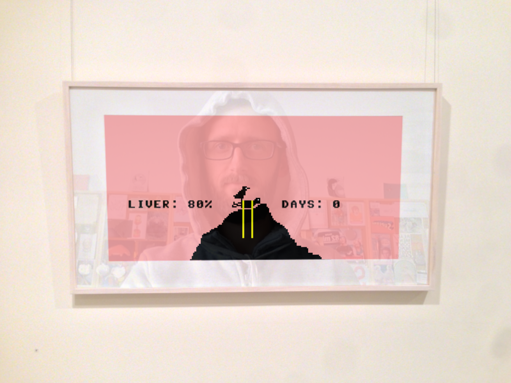
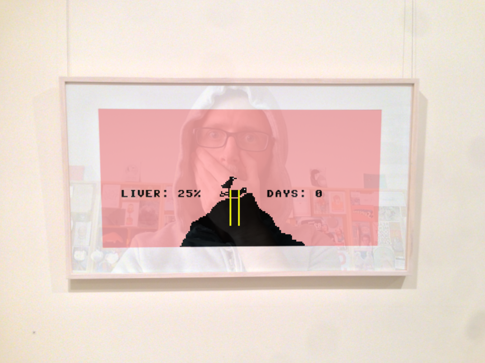
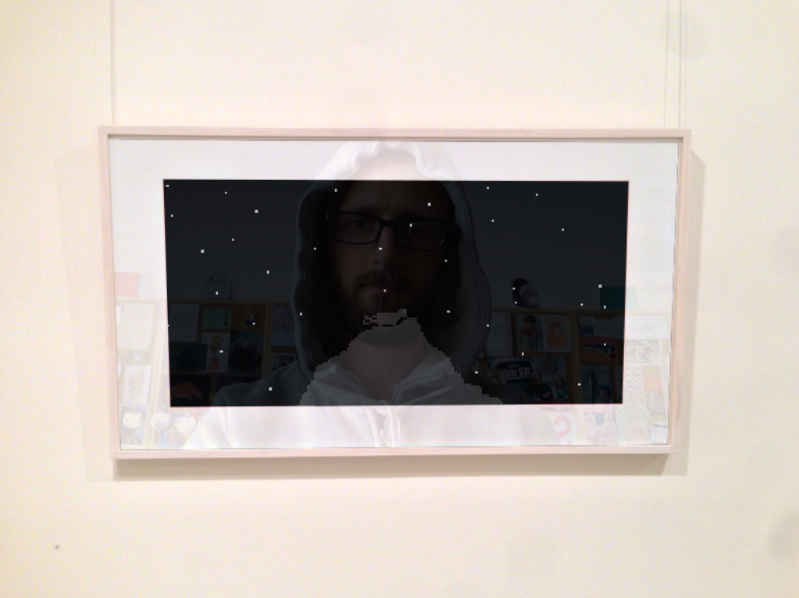
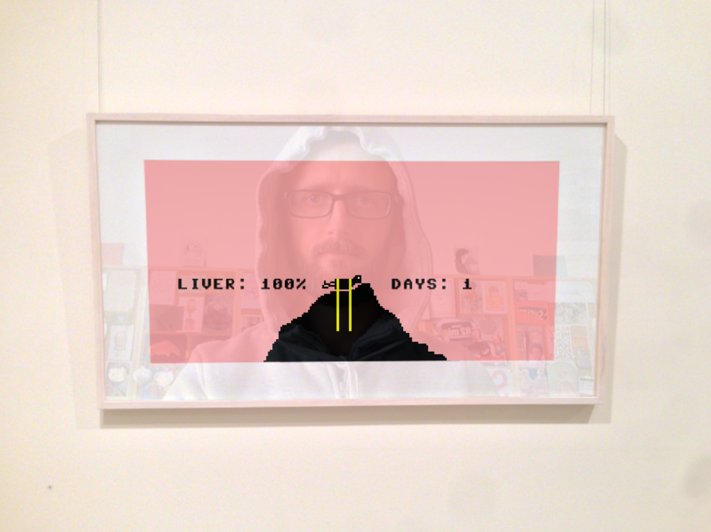

# *Let's Play: Let's Play: Ancient Greek Punishment: Art Edition Edition* Press Kit

#### [Play Online](https://pippinbarr.github.io/lets-play-lets-play-ancient-greek-punishment-art-edition-edition/)

## The basics

* Developer: [Pippin Barr](http://www.pippinbarr.com/)
* Release: 14 January 2015
* Platform: Browser (mobile- and tablet-friendly)
* Code repository: https://www.github.com/pippinbarr/lets-play-lets-play-ancient-greek-punishment-art-edition-edition/
* Price: $0.00

## Description
It's a game! In a painting! On a wall! In a gallery! In a game! Or something! Marvel as you once again confront that most boring question! Are games art?! Is art some kind of a damn game to you?! You be the (art) judge!

## History
There was an exhibition of my work at Andrew Baker Gallery from 26 November to 20 December 2014. The show included games, but mostly featured very good looking large prints of screenshots from my game Safety Instructions. In addition, a downstairs room had prints from other games, including the Prometheus scene from Let's Play: Ancient Greek Punishment. I took various photos to document the exhibition and the photo of that last print caught my eye when I imagined turning the photo itself into a game (something I've thought about a fair bit lately in the question for different visual aesthetics). So I made a version of the Prometheus game that runs "inside" the picture frame. To add to the effect, I also worked on ways to make the digital version of the frame picture reflective in the way it was in the gallery. This extends to (in the best scenario) a live webcam-based reflection that works on desktop versions of Chrome, Firefox, and Opera, a video-based reflection that works in Internet Explorer and Safari, and an animated image-based reflection in mobile browsers. It was quite the technical challenge for me, working with new web technologies I've not encountered before. Importantly, I think it achieves its basic aim of a weird remediation of a remediation etc., all in a big beautiful chain. It has given me more ideas in this vein which I'm looking forward to putting together.

## Features
* Art.
* Remediation.
* Reremediation.
* Rereremediation?
* You or me.

## Videos

### [Let's Play: Let's Play: Ancient Greek Punishment: Art Edition Edition Trailer](https://www.youtube.com/watch?v=R34-5WNs4PE)

## Images

## Credits

* Pippin Barr: everything.

## Contact

* Email: [pippin.barr+press@gmail.com](mailto:pippin.barr+press@gmail.com)
* Website: [www.pippinbarr.com](http://www.pippinbarr.com/)
* Twitter: [@pippinbarr](https://www.twitter.com/pippinbarr)
* Facebook: [Pippin Barr](http://www.facebook.com/pippin.barr)
