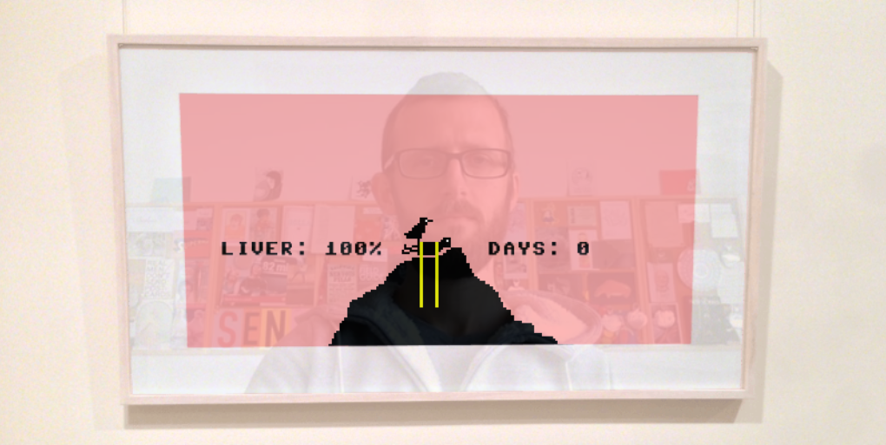

# Blog Posts

Public facing blog post(s) about the game.

## Got Me By the Technicals (2015-01-13)

I've been working on a new game (called _Let's Play: Let's Play: Ancient Greek Punishment: Art Edition Edition_) over the last couple of days &#8211; it should be out tomorrow evening. I've returned to HTML5 so that it's mobile-friendly and so on, but I've also been forced (by the nature of the game) to engage more heavily in various new technical details than I normally bother with. This is the price of the "new aesthetics" I'm trying to use so that I don't just turn into Sierraman or Atariguy or something.

This particular game involves including video from the players webcam as part of the visuals, and this took me into a (for me) complex world of browser hell. See, things don't "just work" in this world, there are a million exceptions for the things you want to do. Webcams work in Chrome, Firefox and Opera on desktop only, for instance. But then it didn't even work in Firefox because there was a weird bug that meant you need to slightly delay the webcam stream or you get an error.

So without webcam available for all browsers (and especially not on mobile) I needed a fallback. So then you try to include video that approximates the kind of thing you'd see through a webcam (me, in this case). But of course different browsers support different video formats (in this case I used webm and mp4). And then different platforms (like phones) only support specific encodings of specific video formats. In fact I fought so long and unsuccessfully to get video in the mobile version that I ended up needing a _third_ fallback, an animated set of photos of me blinking!

So when you try to do anything technical like this you suddenly end up catering to many different versions of the simple thing you're trying to make. You have multiple codecs, multiple representation options, you need to switch between them sometimes (e.g. from video to webcam if the player enables their webcam, so they don't see nothing before that). And on and on. I spent quite a lot of time learning and failing. But I ended up getting it to work.

At which point I marvel: wow, what a huge amount of work to do something so absurdly simple. What an annoying medium it is we work in with games for the web. And I ask: what influence does all this technical stuff (particularly the long bouts of fighting for a single inch of technological territory) have on the actual games we make? By which I don't even mean the subtle and interesting rhetorical powers of the tools we use, but just literally the labyrinths of technical know-how required just to do one, atomic thing (like show a bloody moving picture on the screen).

So, was it worth it? Just how different are the animated image, canned video, and webcam versions of this game? Did I waste my time?

You be the judge, tomorrow probably.

## Let's Write About: Let's Play: Let's Play: Ancient Greek Punishment: Art Edition Edition (2015-02-02)

I don't think I ever got around to writing a post about [this game](http://www.pippinbarr.com/games/lets-play-lets-play-ancient-greek-punishment-art-edition-edition/) after releasing it a couple of weeks ago, so this is that post because I can't think of anything else to write about this evening. Specifically, here is The Story of the Game.

Many moons (about three years) ago I made a game called [_Let's Play: Ancient Greek Punishment_](http://www.pippinbarr.com/games/lets-play-ancient-greek-punishment/). That game was all about futility and the ability of a videogame to sort of represent infinity – or perhaps at least a genuine willingness to pursue infinity to the extent that as a player you could "feel" infinity. One of the "levels" of the game was based on the myth of Prometheus, the Titan doomed to have his liver pecked out by an eagle every day and grown back overnight. All for giving humans fire. A tough break.

That game was "successful" and was played by a lot of thousands of people, which was terrific. Then, last year there was a solo exhibition of one of my games, [_Safety Instructions_](http://www.pippinbarr.com/games/safety-instructions/), at the [Andrew Baker gallery](http://www.andrew-baker.com/) in Brisbane, Australia. Most of the show was made up of very good-lookin' prints of screenshots from _Safety Instructions_, but there were also prints from a couple of other games, including the Prometheus scene from _Let's Play: Ancient Greek Punishment_.

Thus, when I went to the exhibition in December 2014 I had the very odd experience of confronting a game (such as the Prometheus scene) remediated as a screenshot remediated as an artwork framed and behind glass on a wall. That was interesting to me because it's such a strange direction for a game to go in: from movement to stillness, from interactivity to passivity, from jokey meme to official art-on-wall, etc. I actually had a bit of difficulty thinking about the exhibition and my relationship to it, frankly, because of that odd remediation going on. (Although of course the games themselves were on display too.)

So an obvious way to react to this, in my book at least, was to re-remediate the game-as-painting back into a game. I'd taken photographs of the various prints in the show and chose to turn the photo of the Prometheus scene _back_ into the Prometheus scene game. Such that it goes from static photograph of framed print back over to playable game. To complete the strange feeling of standing in front of an "art" I slaved over getting a webcam "reflection" of the player in the "glass" covering the game. So you end up with an attempt to meld the two ideas – it's still framed and on a wall and "art", but it's also a weird playable game.

Plus, as a throwaway weirdness that I rather like, the player becomes in many ways the central "asset" of the game, the most important piece of imagery it shows. Not to mention how you could spin off into commentary about appearing as a good above Prometheus, determining not whether he should suffer, but whether he should even be permitted allowed to writhe. Dark stuff.

That's a story, now's it's done.
